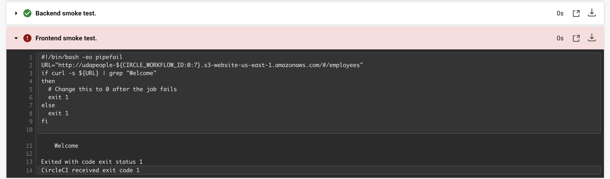
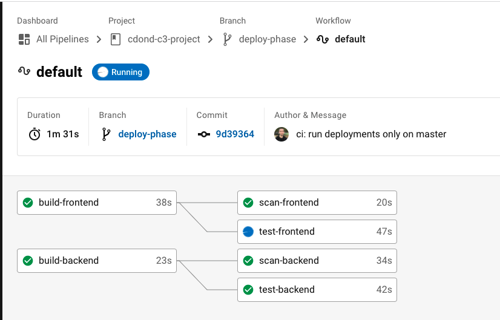
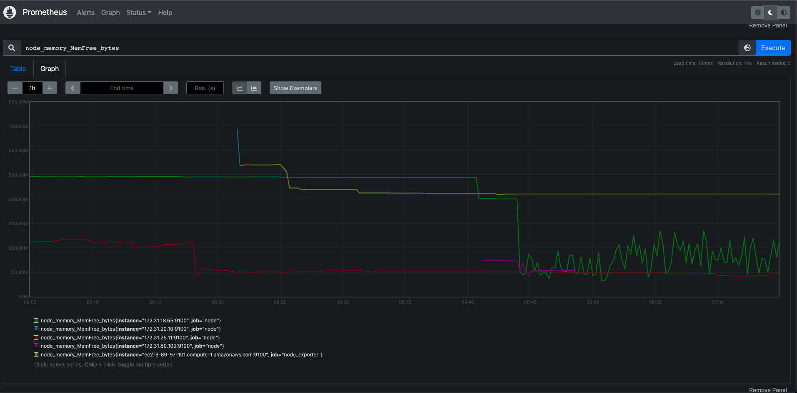
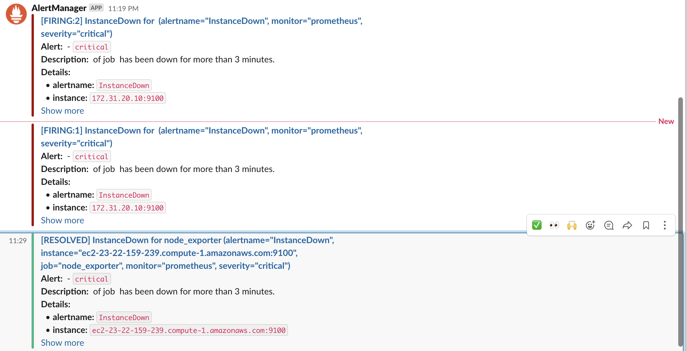

## Project: Give Your Application Auto-Deploy Superpowers

### Project Submission
| Description | Screenshot |
| --- | ----------- |
| Job failed because of compile errors | [SCREENSHOT01] |
| Job failed because of unit tests | [SCREENSHOT02] |
| Job that failed because of vulnerable packages | [SCREENSHOT03] |
| An alert from one of your failed builds | [SCREENSHOT04] |
| Appropriate job failure for infrastructure creation | [SCREENSHOT05] |
| Appropriate job failure for the smoke test job |  |
| Successful rollback after a failed smoke test | [SCREENSHOT07] |
| Successful promotion job | [SCREENSHOT08] |
| Successful cleanup job | [SCREENSHOT09] |
| Only deploy on pushed to `master` branch |  |
| Provide a screenshot of a graph of your EC2 instance including available memory, available disk space, and CPU usage |  |
| Provide a screenshot of an alert that was sent by Prometheus |  |

### Built With
- [Circle CI](www.circleci.com) - Cloud-based CI/CD service
- [Amazon AWS](https://aws.amazon.com/) - Cloud services
- [AWS CLI](https://aws.amazon.com/cli/) - Command-line tool for AWS
- [CloudFormation](https://aws.amazon.com/cloudformation/) - Infrastrcuture as code
- [Ansible](https://www.ansible.com/) - Configuration management tool
- [Prometheus](https://prometheus.io/) - Monitoring tool

### Useful Links
- [How to setup Prometheus.](https://codewizardly.com/prometheus-on-aws-ec2-part1/)